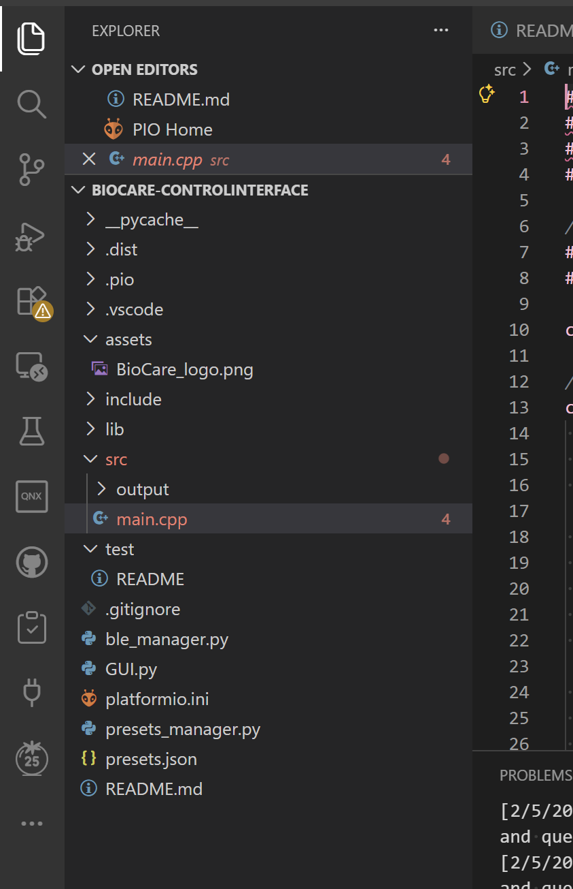

# BioCare-PROTO-ControlInterface
GUI devloped in Python to communicate with an ESP32 controlled prosthetic arm using BLE. 

--------------How to Run the Code------------

#Step 1:

Clone the github repo and clone it to your vscode or prefered IDE

#Step 2:

Go on the ```BioCare_Appv2_python``` branch

#Step 3:

Install the following packages from python (also in your env you've created):

```pip install py```
```pip install PyQt6```
```pip install qtawesome```
```pip install platformio```
```pio run --target clean```
```pip install --upgrade platformio```
```pio project init --ide vscode```
```pio platform install espressif32 --force```
```pio pkg install```

then create a .venv -- this is a virtual environment


#Step 4:


Install the extension: 
```Platformio```
```Arduino```
```Arduino Community Edition```

#Step 5:

Open this project in the Platformio extension


#Step 6: 

To run code use this: ```pio run```
or
Press ```Ctrl + Shift + P``` to open a list of commands
Search for ```PlatformIO: Build``` to build the project -- a tempCodeRunnerFile should appear when you are building the project
