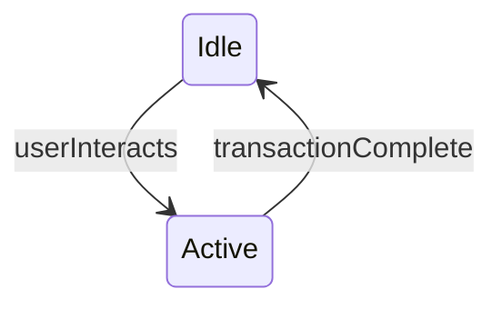

## Brief introduction to state diagrams for newcomers:
- A UML State Machine Diagram is a *behavioural model*. Unlike some other types of UML diagrams, it does *not* describe the architecture or internal objective structure of the system. Instead, it describes how the system responds to certain stimuli by modelling its behaviour as a state machine.
- This team has chosen to use red arrows to represent state transitions. State transitions are conceptually instantaneous: *i.e.* there is zero time between two states. Consequently, the State Machine is always in some state, and never really *between* two states.
  - **Note:** In real life, state transitions may take some time—albeit very little time—to perform. The State Machine model is idealistic, and this short time is considered negligible. If you notice that a certain transition should by design take a noticeable amount of time, perhaps you should really model this so-call "transition" into a _state_ instead. For example: when MS Windows takes an hour to update, that is *not* a transition; it is a *state*. On the contrary, if you press a key on your keyboard to shut down Windows, "shutting down" and "powered off" should be states, but "key pressed" should probably not, as it takes a negligible amount of time for the keyboard driver and signal handler to perform their job and move on to the next state.
- A state is something that the machine itself is aware of, and this team has chosen to represent states using yellow boxes. A state most consume *some* time, that is, the State Machine must remain in any given state for a length of time *above* zero. For example, a cola dispenser remains in the "idle" state for as long as no one uses it, and may instantaneously switch into the "active" state when someone interacts with it. You could then vulgarly model the dispenser as follows:

- Note that UML State Machine Diagrams do *not* describe where signals come from, or in what sequence they occur. That type of behavioural information is rather conveyed using a UML Sequence Diagram. For the sake of this project, no UML Sequence Diagram will be used, since the robotic arm's simple firmware design does not call for it.
- To learn more about UML State Machine Diagrams, consult [this useful resource](https://www.uml-diagrams.org/state-machine-diagrams.html).

## Explanation of the BioCARE arm state diagram
- Some may wonder why the `Idle` state in the arm State Machine. Well, the prosthetic forearm does not necessarily move *all* of the time, so its user must be able to indicate their intention to rest at times. Whilst the `Idle` state may seem useless, it is essential to model how the arm can go from resting to moving.
- The State Machine does not necessarily say what exact signals are required for a transition to occur. Instead, the transitions are modelled as mere functions, named accordingly to the intention they convey. Transitions may be initiated by users, peripherals, or the system itself. In this case, most signals in the diagram are human-initiated, but some may also come from the interactive phone application, for example.
- A table containing user commands and their corresponding actions will eventually be developed and placed within the Git repo. The action table is analogous to a keyboard shortcut list, where each action has a corresponding hotkey. This will make the design modular: it will be possible to change which actions correspond to given commands without touching the state machine, effectively allowing control system development and firmware driver development to be virtually uncoupled.

- [ ] **TODO:** Complete action table.

- Specific design notes may be found in the State Machine Diagram, and are displayed as white boxes with a folded bottom-left corner.